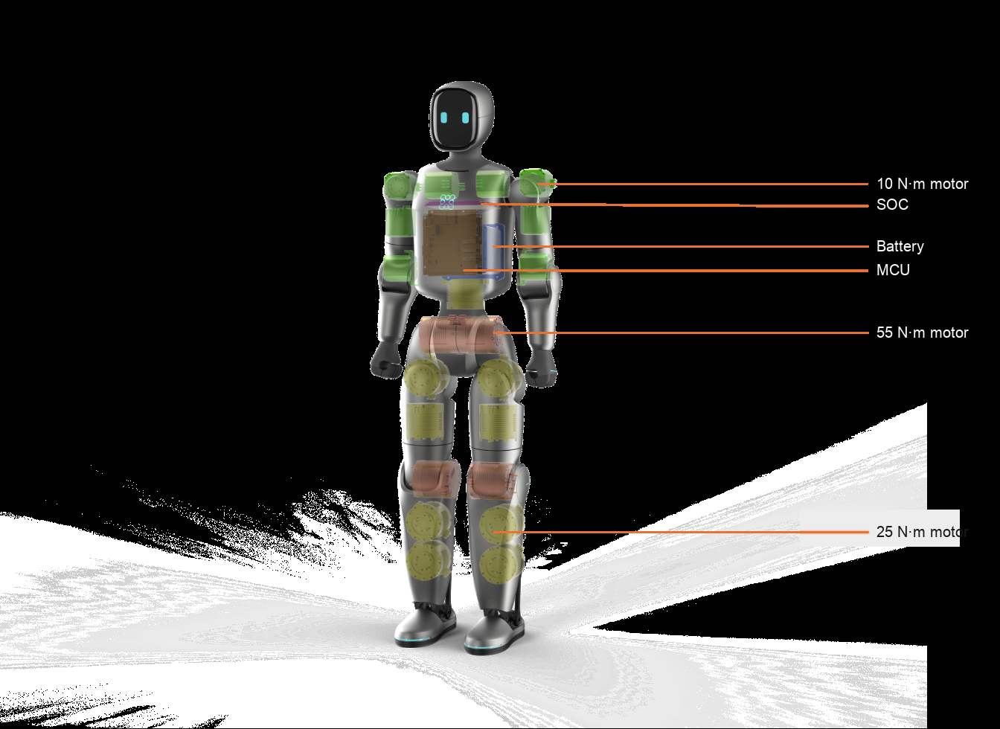

# OpenBridge

**Chinese version (attachment):** [README.zh-CN.md](README.zh-CN.md)

The open-source ecosystem of Zeroth Robotics. Robot body = 小桥 = Zeroth Bridge.

This repository is the **product overview**. Open-source content is organized into three Hubs:

| Repository | Hub | Description |
| --- | --- | --- |
| [OpenBridge-Robot-Hub](https://github.com/Zeroth-OpenBridge/OpenBridge-Robot-Hub) | Robot Hub | Connects the robot to the hardware boundary: device integration, environment setup, and enclosure / interface / accessory specifications |
| [OpenBridge-Skill-Hub](https://github.com/Zeroth-OpenBridge/OpenBridge-Skill-Hub) | Skill Hub | Skill development: SDK, API, skill templates, and official examples |
| [OpenBridge-Simulation-Hub](https://github.com/Zeroth-OpenBridge/OpenBridge-Simulation-Hub) | Simulation Hub | Simulation and validation: simulation examples, getting-started code, debugging, and FAQs |

Document version: V1.0  
Applicable model: 小桥 / Zeroth Bridge

---

## Product Overview

  

The open-source system has two parts: the OpenBridge developer ecosystem, and the hardware body Zeroth Bridge (小桥). The brand entity is Zeroth Robotics.

OpenBridge is the first fully open-source ecosystem for developers in embodied intelligence. Built around a highly usable embodied robot, it aims to create an open, collaborative developer platform where creators worldwide can jointly build, share, and co-create robot capabilities.

- Platform: a collaborative platform for robot innovation. Its core value is lowering the barrier to embodied-robot development and skill creation, not building closed technical moats.
- Foundation: unified development tools, shared training resources, and the Skill Hub marketplace — a standardized collaboration base for developers, enthusiasts, and hardware partners.
- Community: robot skills and technical solutions are freely shared, reused, and iterated in the community, so participants help each other grow and collective creation advances the field.

Zeroth Bridge (小桥) is designed for demonstrations, education, teleoperation, and small-object interaction, and is also suitable for home deployment: it can be carried with one hand, is quiet and lightweight, poses less risk to furniture and people, and does not require a lab-grade space. OpenBridge enables developers, enthusiasts, and hardware partners to create skills, share training resources, and collaborate on a unified foundation.

---

## Appearance and Structure

  
  

---

## Specifications

| Key spec | Requirement | Notes |
| --- | --- | --- |
| Overall height | 85 cm | Currently an ~80 cm-class small humanoid, suited to demonstrations, education, teleoperation, and small-object interaction |
| Shoulder height | 73 cm | Suited to low tabletops, children's desks, and near-floor motion demos; not suited to fine manipulation at adult kitchen counters |
| Hip / base height | 50 cm | Determines gait center of mass, fall height, and safety-test bounds; more readily conveys an equal, reliable tool or assistant |
| Leg length | ~50 cm | Structural segment length affects routing, enclosure, and mechanical stacking; Z-axis projected length affects standing height and gait |
| Arm length | 30–40 cm, with a two-finger gripper | Currently closer to a short-arm motion demo / teleoperation validation platform; visually at home in a living space, without a sense of intimidation |
| Shoulder width | 13 cm between joint centers | Shoulder width is controlled without sacrificing self-collision clearance, reducing encroachment on the arm workspace |
| Overall mass | ~10 kg | Lightweight and highly dynamic |

---

## Degrees of Freedom

| Body region | Joint | DoF | Peak torque |
| --- | --- | --- | --- |
| Arms | Shoulder up/down | 1 | 10 N·m |
|  | Shoulder front/back | 1 | 10 N·m |
|  | Shoulder in/out | 1 | 10 N·m |
|  | Elbow up/down | 1 | 10 N·m |
| Waist | Waist rotation | 1 | 25 N·m |
| Legs | Hip | 1 | 55 N·m |
|  | Thigh | 2 | 25 N·m |
|  | Knee | 1 | 55 N·m |
|  | Ankle | 2 | 25 N·m |

---

## Motion and Task Capabilities

- Walking / motion speed: 0.2 m/s
- Payload: add-ons can be mounted on the body
- Tasks: demonstration, education, teleoperation, and small-object interaction; covers motion demos and development validation
- Currently stable: standing, walking, backflip, low-difficulty dance, and Mongolian dance

Teleoperation includes three modes: basic remote control, VR upper-body following, and WBC whole-body synchronization. The full stack is wireless: the controller and VR connect over Bluetooth, while application traffic rides on Wi-Fi; with stable networks at both ends, control can be performed across regions. The current version ships with IMU and motor-internal feedback only — no LiDAR or cameras; the corresponding hardware interfaces are reserved.

---

## Mechanical Structure

A compact humanoid with a slender body. Key dimensions and mass follow the specification table (85 cm / ~10 kg). The chest shell is soft TPU.

**Body structure diagram**

  

For detailed drawings, BOM, and assembly instructions, see [Robot Hub](https://github.com/Zeroth-OpenBridge/OpenBridge-Robot-Hub).

---

## How to Use the Open-Source Materials

Unlike projects that only open part of the software, OpenBridge is fully open-source: there is no extra restricted-tier SDK or API.

1. Start with this repository to understand the product and the scope of what is open-sourced.
2. Connecting the robot to the hardware boundary: see [Robot Hub](https://github.com/Zeroth-OpenBridge/OpenBridge-Robot-Hub).
3. Skill development: see [Skill Hub](https://github.com/Zeroth-OpenBridge/OpenBridge-Skill-Hub).
4. Simulation and validation: see [Simulation Hub](https://github.com/Zeroth-OpenBridge/OpenBridge-Simulation-Hub).

Sharing and reusing skills in the community is encouraged. Hardware interfaces are already reserved, supporting DIY, appearance mods, and third-party hardware.

Each repository uses `CHANGELOG.md` to record release notes for every version.

---

## Roadmap

We will continue to improve development tools, shared training resources, and Skill Hub. Images, engineering details, and materials not yet in the repositories will be added over time.

The license is [GNU General Public License v3.0](LICENSE). If you build or modify a complete robot yourself, please assess the risks of close-to-people use and high-dynamic motion on your own.

---

**Chinese version (attachment):** [README.zh-CN.md](README.zh-CN.md)
