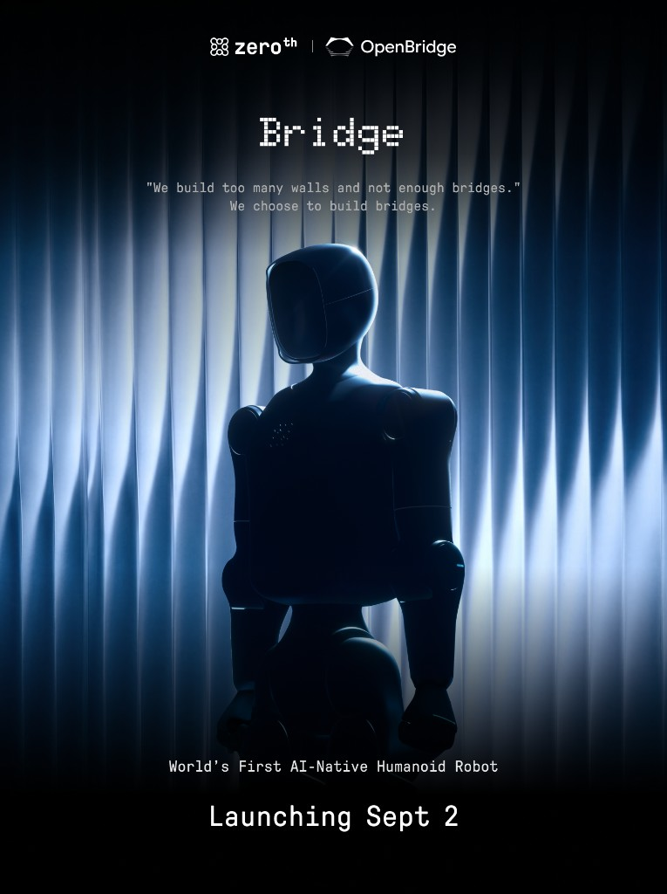
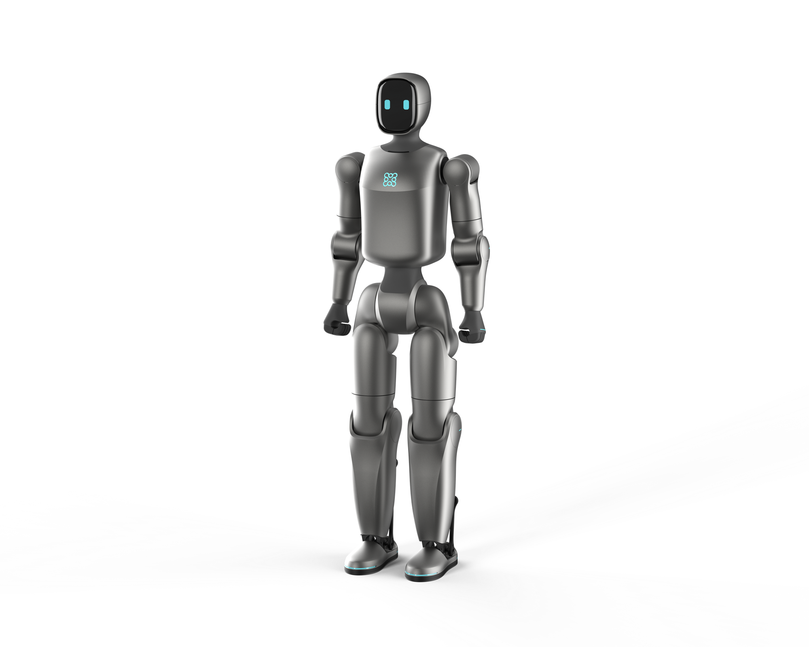
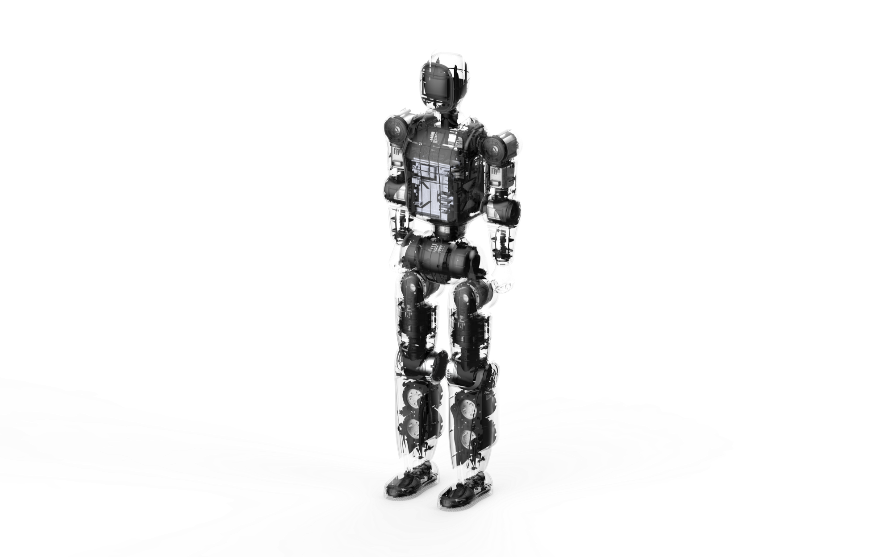

# OpenBridge

元点机器人开源生态。机器人本体 = 小桥 = Zeroth Bridge。

本仓库为**产品整体介绍**。开源内容按三个 Hub 划分：

| 仓库 | Hub | 说明 |
| --- | --- | --- |
| [OpenBridge-Robot-Hub](https://github.com/Zeroth-OpenBridge/OpenBridge-Robot-Hub) | Robot Hub | 连接机器人与硬件边界：设备接入、环境配置、外壳 / 接口 / 配件规范 |
| [OpenBridge-Skill-Hub](https://github.com/Zeroth-OpenBridge/OpenBridge-Skill-Hub) | Skill Hub | 技能开发仓库：SDK、API、技能模板与官方示例 |
| [OpenBridge-Simulation-Hub](https://github.com/Zeroth-OpenBridge/OpenBridge-Simulation-Hub) | Simulation Hub | 仿真与验证仓库：仿真示例、开箱代码、调试与常见问题 |

文档版本：V1.0  
适用机型：小桥 / Zeroth Bridge

---

## 产品概述

  

开源体系由两部分构成：OpenBridge 开发者生态，以及硬件本体 Zeroth Bridge「小桥」。品牌主体为元点机器人。

OpenBridge 是首个面向具身智能领域开发者的全开源生态，旨在基于最好用的具身本体，打造开放协作的开发者平台，支持全球创作者共建、共享、共创机器人能力。

- 平台属性：机器人创新协作平台，核心价值是降低具身机器人开发与技能创作的门槛，而非构建封闭的技术壁垒。
- 核心载体：提供统一开发工具、共享训练资源与 Skill Hub 技能广场，为开发者、爱好者、硬件合作伙伴提供标准化的协作底座。
- 社区理念：鼓励机器人技能与技术方案在社区内自由分享、复用迭代，让参与者彼此促进、共同成长，以群体共创推动行业整体进步。

Zeroth Bridge「小桥」面向展示、教育、遥操及小物体交互，也适配家庭部署：单手可拎取，低噪、轻量化，对家具和人员的潜在伤害更低，无需实验室级场地。OpenBridge 支撑开发者、爱好者与硬件合作伙伴在统一底座上完成技能创作、训练资源共享与社区协作。

---

## 整机外观与结构

  
  

---

## 整机规格

| 核心参数 | 参数需求 | 说明 |
| --- | --- | --- |
| 整机高度 | 85 cm | 当前为约 80 cm 级小人形，适合展示、教育、遥操和小物体交互 |
| 肩膀高度 | 73 cm | 适合低台面、儿童桌、地面附近动作展示，不适合成人厨房台面精细操作 |
| 髋 / 基座高度 | 50 cm | 决定步态质心、摔倒高度和安全测试边界；更易形成平等、可靠的工具或助手感 |
| 腿部长度 | 约 50 cm | 结构段长度影响布线、外壳与机械堆叠；Z 向投影长度影响站立高度和步态 |
| 手臂长度 | 30–40 cm，带二指夹爪 | 当前更接近短臂动作展示 / 遥操验证平台；视觉上融入家居，无压迫感 |
| 肩宽 | 关节中心距离 13 cm | 在不牺牲自碰撞空间的情况下控制肩宽，减少手臂工作空间侵占 |
| 整机质量 | 约 10 kg | 轻量化、高动态 |

---

## 自由度配置

| 身体部位 | 名称 | 自由度 | 峰值力矩 |
| --- | --- | --- | --- |
| 手臂 | 肩部上下 | 1 | 10 N·m |
|  | 肩部前后 | 1 | 10 N·m |
|  | 肩部内外 | 1 | 10 N·m |
|  | 肘部上下 | 1 | 10 N·m |
| 腰部 | 腰部旋转 | 1 | 25 N·m |
| 腿部 | 髋关节 | 1 | 55 N·m |
|  | 大腿 | 2 | 25 N·m |
|  | 膝盖 | 1 | 55 N·m |
|  | 踝关节 | 2 | 25 N·m |

---

## 运动与作业能力

- 行走 / 运动速度：0.2 m/s
- 负载能力：本体上可进行加装
- 作业任务：展示、教育、遥操和小物体交互；可覆盖动作演示与开发验证
- 当前已稳定：站立、行走、后手翻、低难度舞蹈与蒙古舞

遥操作含基础遥控、VR 上半身跟随、WBC 全身同步三类。全链路无线：手柄与 VR 经蓝牙连接，业务传输依托 WiFi，两端网络稳定即可跨地域控制。当前版本标配为 IMU 与电机内部反馈，不搭载激光雷达、摄像头；相关硬件接口已预留。

---

## 机械本体整体结构设计

小型人形，机身苗条。关键尺寸与质量以整机规格表为准（85 cm / 约 10 kg）。胸壳为 TPU 软质材料。

更细的图纸、BOM 与装配说明见 [Robot Hub](https://github.com/Zeroth-OpenBridge/OpenBridge-Robot-Hub)。

---

## 开源怎么用

区别于只开放部分软件的半开源，OpenBridge 为全面开源：无额外限制级 SDK / API。

1. 先读本仓库，了解产品和开源范围。
2. 连接机器人与硬件边界：见 [Robot Hub](https://github.com/Zeroth-OpenBridge/OpenBridge-Robot-Hub)。
3. 技能开发：见 [Skill Hub](https://github.com/Zeroth-OpenBridge/OpenBridge-Skill-Hub)。
4. 仿真与验证：见 [Simulation Hub](https://github.com/Zeroth-OpenBridge/OpenBridge-Simulation-Hub)。

鼓励在社区内分享与复用技能；硬件接口已预留，支持 DIY、外观改造与第三方硬件接入。

各仓库用 `CHANGELOG.md` 记录每一版 ReleaseNote。

---

## 后续计划

持续完善开发工具、共享训练资源与 Skill Hub。图片、工程细节与尚未放入仓库的资料后续补齐。

许可证为 [GNU 通用公共许可证 v3.0（GPL-3.0）](LICENSE)。自制或改装整机请自行评估近人使用与高动态动作风险。
